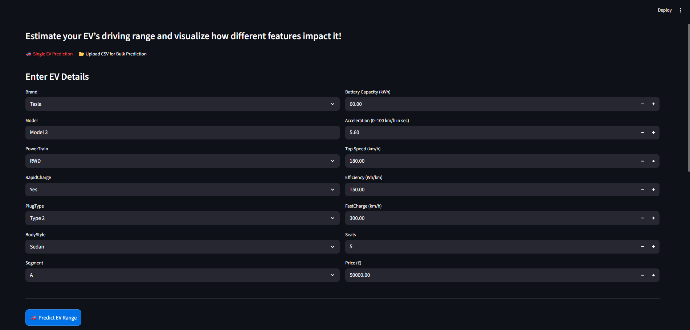
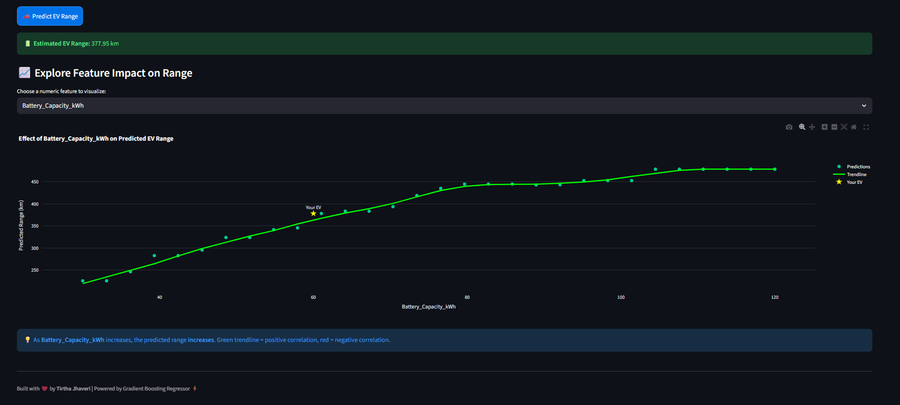

# ⚡ EV Range Prediction Web App

A **Machine Learning-powered Streamlit web application** that predicts the **electric vehicle (EV) driving range** based on parameters such as battery capacity, efficiency, top speed, acceleration, and price.  
The app includes **interactive data visualizations**, **feature importance analysis**, and **dynamic plots** showing the relationship between each feature and the predicted range.

---

## 🚀 Overview

This project combines **Machine Learning (Regression)** with an **interactive Streamlit dashboard**.  
It helps users understand how key EV features influence the predicted driving range, while also allowing real-time input and visualization updates.

### 🔍 Tech Stack

- **Frontend/UI:** Streamlit + Plotly
- **Backend:** Python (Scikit-learn, Pandas, NumPy)
- **Model Type:** Regression (e.g., Linear Regression, Random Forest, etc.)
- **Visualization:** Plotly for interactive charts
- **Deployment:** Streamlit Cloud / Hugging Face Spaces / Render

---

## ⚙️ Features

✅ Predicts **EV driving range (in km)** based on input features  
✅ Dynamic **feature impact visualization** using feature importance  
✅ Interactive **scatter plots** showing relationships between features and range  
✅ Real-time **dropdown feature selection** for detailed insights  
✅ Fully **responsive UI** with dark mode visuals  
✅ Clean and modular **code structure**

---

## 📊 Dataset

The dataset includes EV specifications and performance metrics such as:

| Feature | Description |
|----------|--------------|
| `Battery Capacity (kWh)` | Total battery capacity |
| `Efficiency (Wh/km)` | Power consumption per kilometer |
| `Top Speed (km/h)` | Maximum achievable speed |
| `Accel (0-100s)` | Time taken to reach 100 km/h |
| `Price (€)` | Approximate price in euros |
| `Range (km)` | Target variable representing real-world range |

---

## 🧠 Model Workflow

1. **Data Preprocessing:** Handle missing values, scaling, encoding  
2. **Model Training:** Fit regression model (e.g., Random Forest, Linear Regression)  
3. **Evaluation:** Calculate metrics like R², RMSE  
4. **Visualization:** Feature importance and correlation plots  
5. **Prediction:** Generate output from user inputs in Streamlit

---

## 💻 Installation

### 1. Clone the repository
```bash
git clone https://github.com/<your-username>/EV-Range-Predictor.git
cd EV-Range-Predictor

---

### 2. Install Dependencies
Make sure you have Python 3.8+ installed. Then run:
```bash
pip install -r requirements.txt

---

### 3. Run the Streamlit App
```bash
streamlit run app.py

---

### 4. Open in Browser
Once the app is running, open it in your browser at:  
[http://localhost:8501](http://localhost:8501)

---

## 5. Deployment (Streamlit Cloud)

1. Go to [Streamlit Cloud](https://share.streamlit.io)  
2. Click **"New app"**  
3. Connect your **GitHub repository**  
4. Configure the following:  
   - **Repository:** `yourusername/EV_RANGE`  
   - **Branch:** `main`  
   - **Main file path:** `app.py`  
5. Click **Deploy 🚀**

---

## 6. Example Output

### 🧮 Prediction:
🔋 **Estimated EV Range:** `410.57 km`

### 📈 Visualization:
- Scatter plot with a **smooth trendline** (green for positive, red for negative correlation).  
- **"Your EV"** marker highlights the predicted value.  
- Interactive dropdown lets you explore how each feature affects range.  

---
## 7. 📸 Screenshots

### 🖼️ App Interface


### 📊 Prediction Output

---

## 📂 Repository Contents

| File | Description |
|------|--------------|
| `app.py` | Main Streamlit app file |
| `ev_range_pipeline.pkl` | Pre-trained ML pipeline |
| `ElectricCarData_Clean.csv` | Dataset used for training *(optional)* |
| `requirements.txt` | Python dependencies |
| `README.md` | Project documentation |

---
## 🤝 Contributing

Contributions are welcome!  
If you'd like to improve this project:

1. **Fork** the repository  
2. **Create a new branch** (`feature-improvement`)  
3. **Commit your changes**  
4. **Submit a pull request** 🚀  

Please ensure your code follows good practices and is well-documented.

---

## 👩‍💻 Author

**Tirtha Jhaveri**  
💡 💡 Passionate about Machine Learning, Full Stack, and Adaptive Web Design. 
📧 *tjhaveri99@gmail.com*   

---

## 🪄 Future Enhancements

- Add more EV brands and models dynamically  
- Support multiple ML model comparisons  
- Deploy with custom domain & branding  
- Add CO₂ savings and battery degradation estimation  

---
## 📜 License

This project is open for educational and personal use.

---

### 🌟 Built with ❤️ by *Tirtha Jhaveri* using **Python** & **Streamlit**

